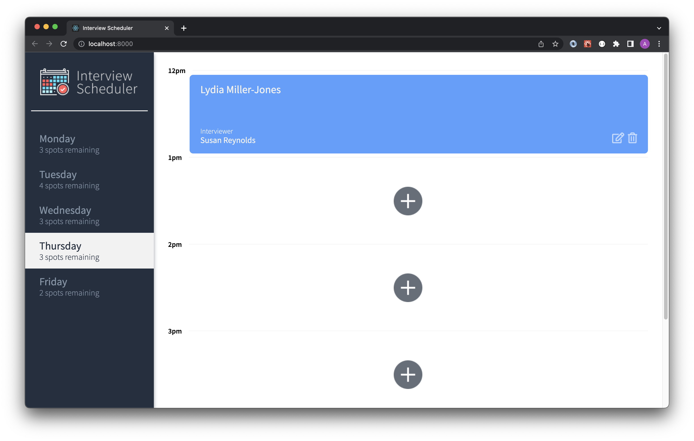
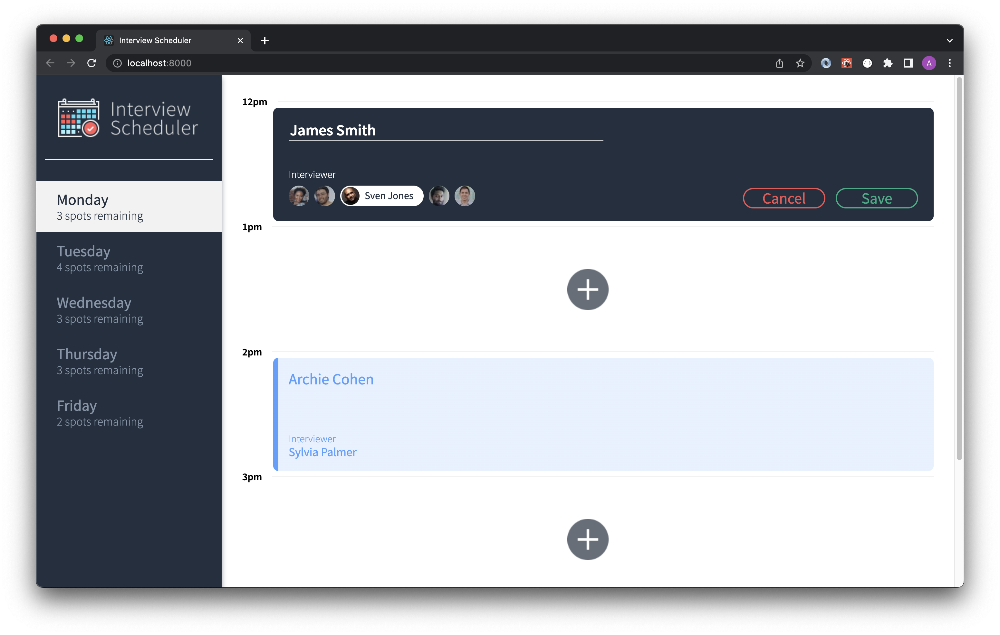
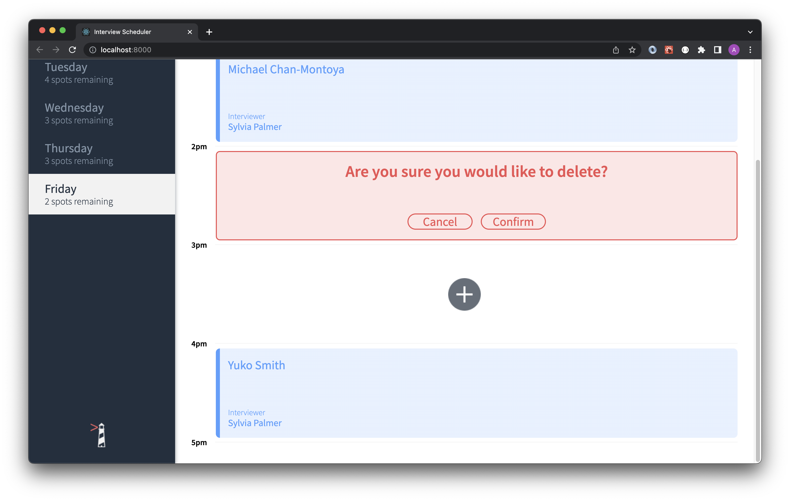
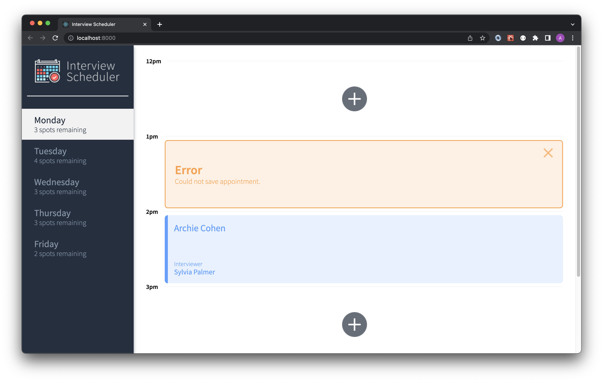

# Interview Scheduler
A client-application that uses the React JavaScript library along with the React Hooks API to build a single-page application that provides a user interface to book interview appointments for students.

Storybook, JEST and Cypress development environments were used to test the React functional components.

The application communicates with an API server over HTTP called Interview Scheduler API.

## Final Product
* Show Appointment


* Appointment Form


* Confirm Delete Appointment Message


* Error Message


## Setup

1. Clone this repository.
2. Install dependencies with `npm install`.
3. Clone the [Interview Scheduler API repository](https://github.com/alricf/scheduler-api).
4. Install dependencies for the Interview Scheduler API with `npm install`.
5. Create a .env.development file in the Interview Scheduler API root folder.
6. Create a local PostgreSQL database and connect with the Interview Scheduler API application by creating a .env.development file. Use the following PostgreSQL configuration for the database and the .env.development file in the application:
```
  * PGHOST=localhost
  * PGUSER=development
  * PGDATABASE=scheduler_development
  * PGPASSWORD=development
  * PGPORT=5432
```
7. Run the Interview Scheduler API servers with `npm start`.
8. Use the browser to navigate to http://localhost:8001/api/debug/reset in order to reset the API database.
9. Run the Interview Scheduler Webpack Development Server.

## Running Webpack Development Server

* `npm start`

## Running Jest Test Framework

* `npm test`

## Running Storybook Visual Testbed

* `npm run storybook`
## Dependencies
* axios
* classnames
* normalize.css
* react
* react-dom
* react-scripts